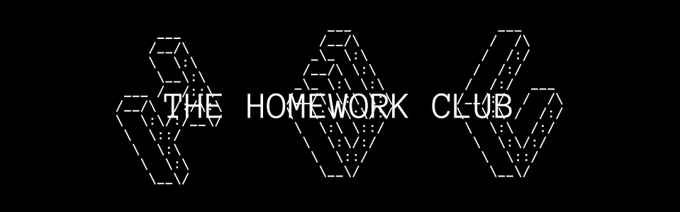

</img>

## Projects
### [Hack OC](https://hackoc.org) - MyMeals
* Status: Submitted/Dropped
* Type: Hackathon/12hr/In-Person
* Description: For HackOC, the Homework Club created MyMeals, an AI meal planner that monitors nutrition, keeps to a diet, and finds meals you love. We won the Best Design award, earning a Keychron K8 keyboard.
* Placement: Best Design
* Participants: Priansh, Aryan, Sebastian, Esean

### [Hack The Wave](https://hackthewave.com) - Whale-GPT
* Status: Submitted/Finished
* Type: Hackathon/12hr/In-Person
* Description: Ever seen a whale riding the trolley? Let us help decide whether you should see a doctor, or if it started raining whales!
* Placement: 2nd Place & People's Choice
* Participants: Andy, Priansh, Sebastian

### [LexHacks](https://lexhackathon.org) - DeepDubbed
* Status: Submitted/In Progress
* Type: Hackathon/48hr/Online
* Description: DeepDubbed uses AI deep learning to realistically and accurately dub in hundreds of languages for free, with both full audio and video coverage
* Placement: 3rd Place
* Participants: Andy, Priansh, Sebastian

### [CrackTheCode](https://crackthecode.dev) (2024) - DependGuard
* Status: Submitted/In Progress
* Type: Hackathon/36hr/In-Person
* Description: Secure Your GitHub Projects with Comprehensive Dependency Analysis and Community Insights
* Placement: 1st Place (Cyber in Depth)
* Participants: Andy, Priansh, Sebastian, Aryan

### [AstroHacks](https://astrohacks.org) - Udder Mayhem
* Status: Submitted/Dropped
* Type: Hackathon/11hr/In-Person
* Description: A live, 3D, Virtual Reality game featuring, you guessed it... cows! (and UFO's)
* Placement: Community Vote Winner
* Participants: Priansh, Andy, Sebastian, Aryan, Esean

### [WaffleHacks](https://wafflehacks.org) - Jukebox
* Status: Submitted/In Progress
* Type: Hackathon/48hr/Online
* Description: Listen to music with your friends, in real time, anywhere in the world.
* Placement: 1st Place in the Best Community Hack Track
* Participants: Priansh, Andy, Aryan, Sebastian

### [United Hacks v3](https://unitedhacks.hackunited.org/) - DJ3000
* Status: Submitted/In Progress
* Type: Hackathon/36hr/Online
* Description: The DJ3000 is a futuristic robot from The Simpsons devised as a joke over 30 years ago. Today, we not only brought this far-fetched fantasy to life, but made it cheap and easy for anyone to use. DJ3000 autonomously generates dynamic radio content using a playlist of preloaded music.
* Placement: 1st Place in the Theme Track.
* Participants: Sebastian, Andy, Priansh

### [Soario - AI Apps Hackathon](https://soario.devpost.com/) - ReVoice
* Status: Submitted/In Progress
* Type: Hackathon/24d/Online
* Description: ReVoice aims to revolutionize education and news diffusion for the general public by providing a dubbing service that translates to over 30 languages.
* Placement: 1st Place
* Participants: Priansh, Andy, Aryan, Sebastian

### [MakeUC](https://makeuc.io/) - Emergency Exit 
* Status: Submitted/Completed
* Type: Hackathon/24hr/Online
* Description: A green technology application that gathers live data regarding fires and uses multi-stage data processing, A* (dijkstra's) algorithm, and LLMs to return the best route in an evacuation scenario.
* Placement: 2nd Place & Social Hacks Winner
* Participants: Priansh, Andy, Sebastian

### [CrackTheCode](https://crackthecode.dev) (2025) - ICS Malware Detection
* Status: Submitted/Completed
* Type: Hackathon/36hr/In-Person
* Description:  A project to protect Industrial Control Systems from cyber attacks by detecting anomalous behavior patterns in system metrics and providing early warning of potential security breaches.
* Placement: 1st Place (Cyber in Depth: ML Mayhem)
* Participants: Andy, Sebastian, Priansh

### [Juice](https://juice.hackclub.com/) - (Project Name Coming Soon)
* Status: Completed
* Type: Hackclub Event/2M/Hybrid (Online -> China)
* Placement: 1st Place (Popular Vote) 
* Participants: Andy, Sebastian, Esean

Total Hackathon Wins: **11**

## Members
* Priansh Mittra - prianshmittra@homeworkclub.dev
* Esean Fang - eseanfang@homeworkclub.dev
* Aryan Jain - aryanjain@homeworkclub.dev
* Sebastian Alexis - sebastianalexis@homeworkclub.dev
* Andy Zhang - andyzhang@homeworkclub.dev

Contact us @ [hello@homeworkclub.dev](mailto:hello@homeworkclub.dev) 
©️ The Homework Club: Dedicated to ~~hacking you~~ helping you with your homework.
